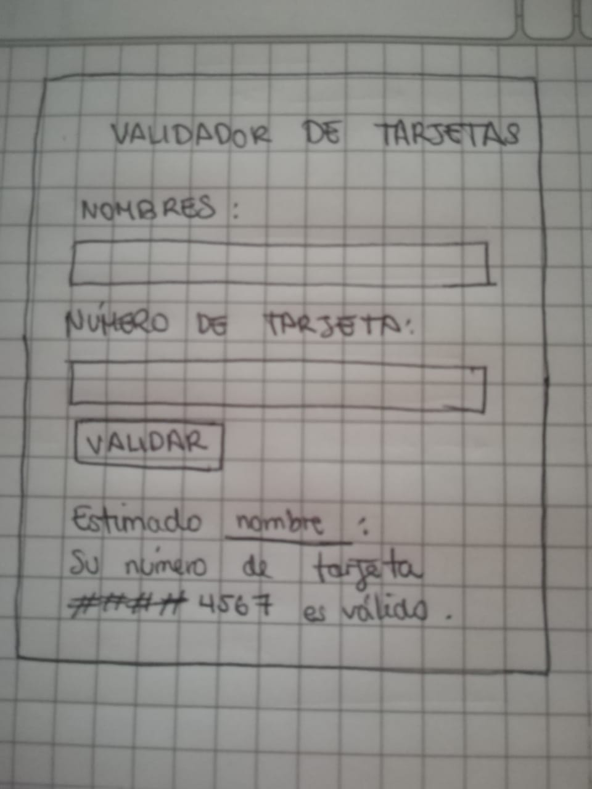
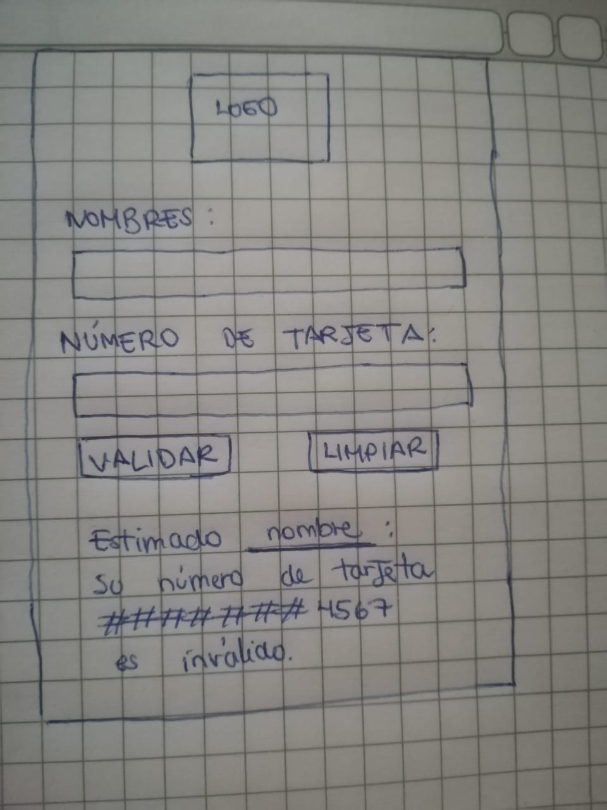

# Validador de tarjeta de crédito para el Restaurante "Brasas"
## Descripción de proyecto
Se utiliza el logaritmo de Luhn para verificar si un número de tarjeta es válido o no. Además de emplea una función para ocultar ciertos dígitos del número de tarjeta.

  

## Usuario y producto
Los usuarios son los clientes del Restaurante "Las Brasas", el dueño del lugar solicitó un sistema para validar las tarjetas de crédito de los clientes antes de que estos realicen el pago por su consumo.

## Solución del problema
Esta es una aplicación que el personal de atención tiene en sus tablets para que puedan verificar si el número de tarjeta de los comensales es válido antes de que realicen su pago.

  

## Feedback para mejorar el proyecto
El feedback que me dieron fue poner un botón para limpiar el formulario, y así se pueda usar nuevamente. Además, de elegir los colores de acuerdo al restaurante e incluir su logo en la aplicación para que sepan que es su aplicación.

  

***
# Objetivos de aprendizaje

## UX

* [x] [Diseñar la aplicación pensando y entendiendo al usuario](https://lms.laboratoria.la/cohorts/lim-2020-01-bc-core-lim012/courses/intro-ux/01-el-proceso-de-diseno/00-el-proceso-de-diseno)
* [x] [Crear prototipos para obtener feedback e iterar](https://lms.laboratoria.la/cohorts/lim-2020-01-bc-core-lim012/courses/product-design/00-sketching/00-sketching)
* [ ] [Aplicar los principios de diseño visual](https://lms.laboratoria.la/cohorts/lim-2020-01-bc-core-lim012/courses/product-design/01-visual-design/01-visual-design-basics)

## HTML y CSS

* [x] [Uso correcto de HTML semántico](https://developer.mozilla.org/en-US/docs/Glossary/Semantics#Semantics_in_HTML)
* [x] [Uso de selectores de CSS](https://developer.mozilla.org/es/docs/Web/CSS/Selectores_CSS)
* [x] [Construir tu aplicación respetando el diseño realizado](https://lms.laboratoria.la/cohorts/lim-2020-01-bc-core-lim012/courses/css/01-css/02-boxmodel-and-display) (maquetación).

## DOM

* [x] [Uso de selectores de nodos del DOM](https://lms.laboratoria.la/cohorts/lim-2020-01-bc-core-lim012/courses/browser/02-dom/03-1-dom-methods-selection)
* [x] [Manejo de eventos del DOM](https://lms.laboratoria.la/cohorts/lim-2020-01-bc-core-lim012/courses/browser/02-dom/04-events)
* [ ] [Manipulación dinámica del DOM](https://developer.mozilla.org/es/docs/Referencia_DOM_de_Gecko/Introducci%C3%B3n)

## Javascript

* [x] [Manipulación de strings](https://lms.laboratoria.la/cohorts/lim-2020-01-bc-core-lim012/courses/javascript/06-strings/01-strings)
* [x] [Uso de condicionales](https://lms.laboratoria.la/cohorts/lim-2020-01-bc-core-lim012/courses/javascript/02-flow-control/01-conditionals-and-loops)
* [ ] [Uso de bucles](https://lms.laboratoria.la/cohorts/lim-2020-01-bc-core-lim012/courses/javascript/02-flow-control/02-loops)
* [x] [Uso de funciones](https://lms.laboratoria.la/cohorts/lim-2019-09-bc-core-lim011/courses/javascript/02-flow-control/03-functions)
* [ ] [Datos atómicos y estructurados](https://www.todojs.com/tipos-datos-javascript-es6/)
* [ ] Utilizar ES Modules (`import` | `export`).

## Testing

* [x] [Testeo de tus funciones](https://jestjs.io/docs/es-ES/getting-started)

## Git y GitHub

* [x] [Comandos de git](https://lms.laboratoria.la/cohorts/lim-2019-09-bc-core-lim011/courses/scm/01-git/04-commands)
  (`add` | `commit` | `pull` | `status` | `push`).
* [x] [Manejo de repositorios de GitHub](https://lms.laboratoria.la/cohorts/lim-2019-09-bc-core-lim011/courses/scm/02-github/01-github)  (`clone` | `fork` | `gh-pages`).

## Buenas prácticas de desarrollo

* [ ] Organizar y dividir el código en módulos (Modularización).
* [x] Uso de identificadores descriptivos (Nomenclatura | Semántica).
* [ ] Uso de linter para seguir buenas prácticas (ESLINT).
